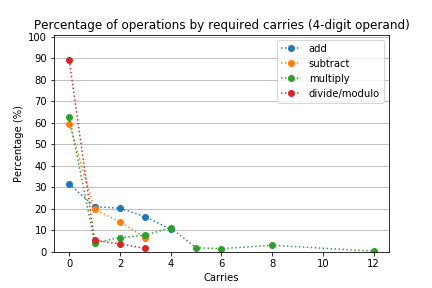
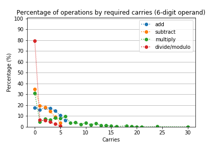
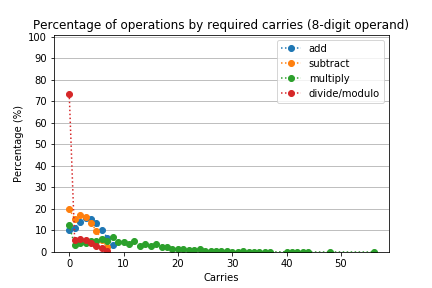

# Arithmetic experiment
To make a program that can do the psychology experiment of arithmetic cognition on human subjects

## Program dependency
1. Python 3.xx
1. Numpy
1. Pandas
1. Matplotlib

# 1. User data

Our user data saved in the directory `user_data`. In `user_data/results`, each file contains experiment data from a participant.

## 1.1. Participant information
1. Birth year (Age) : `int`
1. Gender = `{'male', 'female'}`
1. Math ability (answered by a participant) = `{1:'very bad', 2:'below average', 3:'above average', 4:'very good'}`

The name of the file means the datetime the experiment taken, birth year, gender(1: male, 2: female), and mathematical ability(1-4). For example, `2018-12-06_04_26_02_1999_1_3.result` stands for "This experiment was taken at 04:26:02, Dec. 06, 2018 by a male born in 1999 who had 3-level, above average, mathematical ability."

## 1.2. Experiment data

In the file, its data are organized like below:

| Carry dataset index | Corret | Solving time (sec.) | Answer  | True ansewer | Operand digits | Operator | Carries |
|---------------------|--------|---------------------|---------|--------------|----------------|----------|---------|
| 7                   | True   | 21.242              | 1001110 | 01001110     | 4              | multiply | 2       |

Each row is separated by `'\n'`, and in each row, each column record is separated by `'\t'`. In the actual file, there is no header row.

Carry data index refers to the index with which the operation can be retrieved. For example, we can retrieve the operation like below:
```Python
from data_utils import *
operand_digits = 4 # operand_digits in [4, 6, 8]
operator = 'multiply' # operator in ['add', 'substract', 'multiply', 'divide', 'modulo']
carries = 2
index = 7
carry_datasets = import_carry_datasets(operand_digits, operator)
op_operands = carry_datasets[carries]['input'][index] # concatenated operands
op_result = carry_datasets[carries]['input'][index]
print(op_operands)
print(op_result)
```

# 2. Operation data

For subtraction, we only deal with the case that `operand1 >= operand2` if `operand1 - operand2`. For division and modulo,  we only deal with the case that `operand2 != 0` if `operand1 / operand2` or `operand1 % operand2`.

The number of total operations  

## 2.1. Operation datasets
| Operator | Operand digits | Input dim | Output dim | Total operations |
|----------|----------------|-----------|------------|------------------|
| add      | 4              | 8         | 5          | 256              |
| add      | 6              | 12        | 7          | 4096             |
| add      | 8              | 16        | 9          | 65536            |
| subtract | 4              | 8         | 4          | 136              |
| subtract | 6              | 12        | 6          | 2080             |
| subtract | 8              | 16        | 8          | 32896            |
| multiply | 4              | 8         | 8          | 256              |
| multiply | 6              | 12        | 12         | 4096             |
| multiply | 8              | 16        | 16         | 65536            |
| divide   | 4              | 8         | 4          | 240              |
| divide   | 6              | 12        | 6          | 4032             |
| divide   | 8              | 16        | 8          | 65280            |
| modulo   | 4              | 8         | 4          | 240              |
| modulo   | 6              | 12        | 6          | 4032             |
| modulo   | 8              | 16        | 8          | 65280            |

## 2.2. Carry datasets

### The size of n-carry datasets for each (operator, operand_digits)

Reference this CSV file [carry_dataset_statistics.csv](data/carry_dataset_statistics.csv).

### The distribution of operations by carries





## 2.3. Access to the carry datasets

### Import data structure
```Python
from data_utils import *
operand_digits = 4 # operand_digits in [4, 6, 8]
operator = 'add' # operator in ['add', 'substract', 'multiply', 'divide', 'modulo']
carry_datasets = import_carry_datasets(operand_digits, operator)
```

### How to access the data of `carry_datasets`
How see what kinds of carries exist in the dataset.
```Python
carry_datasets.keys()
```

How to access the 2-carry dataset
```Python
carry_datasets[2]
```

How to access the input the 2-carry dataset
```Python
carry_datasets[2]['input']
```
`carry_datasets[2]['input'].shape == (n_operations, 2 * operand_digits)`

How to access the input the 2-carry dataset
```Python
carry_datasets[2]['output']
```
`carry_datasets[2]['output'].shape == (n_operations, operand_digits)`

How to access the i-th operation in the 2-carry dataset
```Python
carry_datasets[2]['input'][i,:]
carry_datasets[2]['output'][i,:]
```

# Citation

If you want to cite the command line interface (CLI) of this software, then cite this.

```
@inproceedings{ChoLHZ19,
  author    = {Sungjae Cho and Jaeseo Lim and Chris Hickey and Byoung{-}Tak Zhang},
  title     = {Problem Difficulty in Arithmetic Cognition: Humans and Connectionist Models},
  booktitle = {Proceedings of the 41th Annual Meeting of the Cognitive Science Society},
  pages     = {1506--1512},
  year      = {2019}
}
```

If you want to cite the command line interface (GUI) of this software, then cite this.
```
@inproceedings{ChoLHPZ19,
  author    = {Sungjae Cho and Jaeseo Lim and Chris Hickey and Jung Park and Byoung{-}Tak Zhang},
  title     = {Simulating Problem Difficulty in Arithmetic Cognition Through Dynamic Connectionist Models},
  booktitle = {Proceedings of the 17th International Conference on Cognitive Modeling},
  pages     = {29--34},
  year      = {2019}
}
```

# Acknowledgement

Acknowledgement for the CLI experiment.
```
This work was partly supported by the Institute for Information & Communications Technology Promotion (R0126-16-1072-SW.StarLab, 2017-0-01772-VTT, 2018-0-00622-RMI, 2019-0-01367-BabyMind) and Korea Evaluation Institute of Industrial Technology (10060086-RISF) grant funded by the Korea government (MSIP, DAPA).
```

Acknowledgement for the GUI experiment.
```
This work was supported by a grant to Biomimetic Robot Research Center funded by Defense Acquisition Program Administration and Agency for Defense Development (UD160027ID).
```

# License

MIT License
